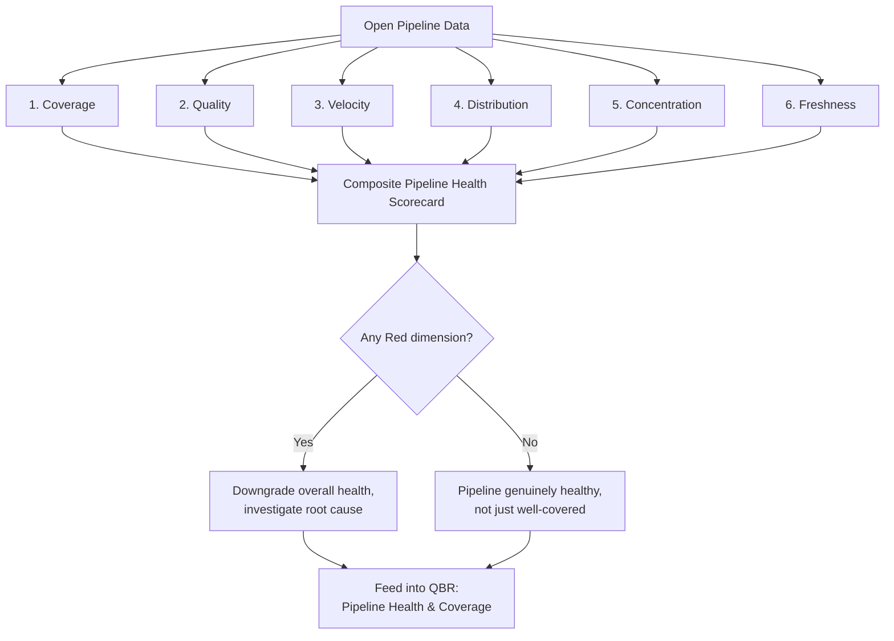
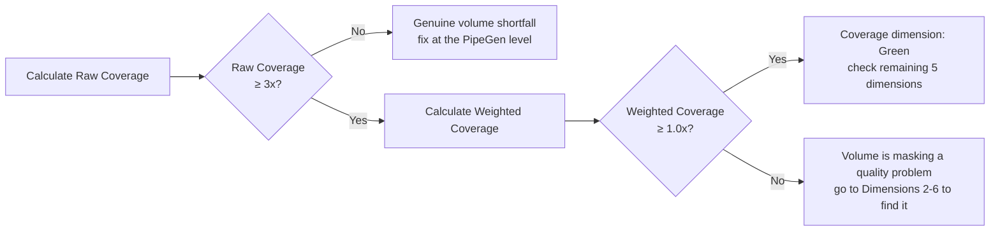
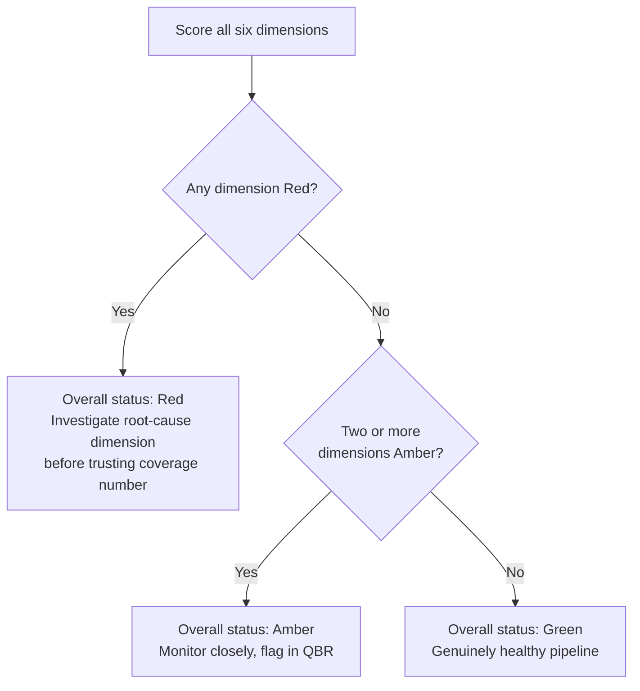
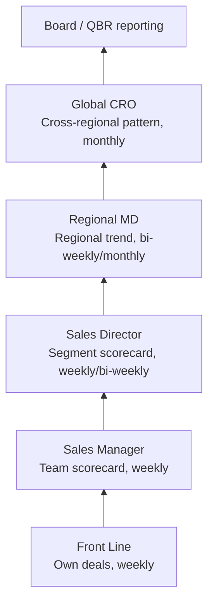

# Pipeline Health Framework

## Purpose
Coverage ratio answers one question — "is there enough pipeline?" — and it's the question most orgs stop at. This framework treats pipeline health as multi-dimensional: a pipeline can carry a healthy coverage ratio and still be in serious trouble underneath it. It builds on the [Pipeline Coverage Calculator](pipeline-coverage-calculator.xlsx), [Sales Forecasting](sales-forecasting.md) (MEDDICC qualification), and [KPI Dictionary](kpi-dictionary.md), and is designed to be inspected at the cadence set out in [Inspection Cadence](inspection-cadence.md).

**The core idea:** a single coverage number can be dangerously reassuring. 3.5x coverage built from stale, low-stage, single-threaded, whale-concentrated deals is a materially worse position than 3.0x coverage that's fresh, well-distributed across stages, and MEDDICC-validated. This framework gives you the six dimensions that separate those two pipelines, so "healthy" means more than "big enough."

---

## How This Framework Fits Together



*Six independent checks roll into one scorecard. A single Red dimension is enough to override an otherwise reassuring coverage number — see Section 8.*

---

## 1. The Six Dimensions of Pipeline Health

| Dimension | Question it answers | Primary signal |
|---|---|---|
| **1. Coverage** | Is there enough pipeline, in principle, to hit the number? | Raw and stage-weighted coverage ratio |
| **2. Quality** | Is the pipeline that exists actually real? | MEDDICC validation depth |
| **3. Velocity** | Is pipeline moving, or sitting still? | Stage-to-stage conversion rate and cycle time |
| **4. Distribution** | Is the funnel shaped the way a healthy funnel should be? | Stage mix vs. historical norm |
| **5. Concentration** | How much of the number depends on a small number of deals? | % of pipeline/quota in top N deals |
| **6. Freshness** | How much of the pipeline is new vs. aging carryover? | Deal age, stage-entry date, net-new vs. rolled-over pipeline |

A pipeline review that only checks Dimension 1 is checking one-sixth of the picture. The rest of this document defines each dimension, how to measure it, and what a red flag looks like.

---

## 2. Coverage

Already covered in depth by the Pipeline Coverage Calculator and KPI Dictionary — included here for completeness and to anchor the other five dimensions against it.

- **Raw Coverage Ratio:** `Open Pipeline ÷ Remaining Quota`. Target 3–4x, segment-dependent.
- **Stage-Weighted Coverage Ratio:** `Σ (Pipeline in Stage × Stage Win Rate) ÷ Remaining Quota`. Target ~1.0–1.2x.
- **Red flag:** Raw coverage looks healthy (≥3x) but weighted coverage is well below 1x — the gap itself is the signal that pipeline volume is masking a quality problem, which is exactly what Dimensions 2–6 exist to diagnose.



---

## 3. Quality (MEDDICC Validation Depth)

Coverage counts dollars; quality asks whether those dollars are attached to real, evidenced deals.

- **Measure:** % of pipeline (by stage or in aggregate) with each MEDDICC pillar *validated* — confirmed by the customer or corroborated by a second source, not just filled into a CRM field by the rep. See Sales Forecasting §1–§3 for the pillar-by-pillar validation bar.
- **A useful single metric:** **MEDDICC Completeness Score** — average number of validated pillars (out of 7) across all Commit/Best Case pipeline.
- **Red flags:**
  - High-value deals in late stages with fewer than 5 of 7 pillars validated
  - "Champion" and "Economic Buyer" consistently the weakest pillars across a team — often means reps are single-threaded and don't know it
  - MEDDICC fields that haven't been updated since the deal was created — a proxy for "nobody has actually re-validated this since the initial call"

---

## 4. Velocity

A pipeline can have great coverage and great qualification and still be too slow to close in the period it's being forecast against.

- **Stage-to-stage conversion rate:** % of deals that advance from one stage to the next within a defined window, by stage.
- **Average time-in-stage:** how long deals typically sit at each stage before advancing (or dying).
- **Cycle time trend:** is average sales cycle length (see KPI Dictionary) lengthening or shortening quarter over quarter?
- **Red flags:**
  - A stage where time-in-stage has been quietly increasing for 2+ consecutive quarters — usually the earliest visible sign of a stalling deal-progression problem, well before it shows up in bookings
  - Deals that skip stages or jump straight to "Commit" — often a sign of stage-gate discipline breaking down rather than a genuinely fast-moving deal

---

## 5. Distribution (Funnel Shape)

A healthy pipeline has a shape — roughly more dollars in earlier stages than later ones, narrowing as deals qualify out. A distorted shape is diagnostic on its own, independent of total coverage.

- **Measure:** % of total pipeline value sitting in each stage, compared to your own historical average shape (not an external benchmark — funnel shape is highly motion-specific).
- **Red flags:**
  - **Back-loaded funnel:** too much pipeline concentrated in late stages relative to history — often means the pipeline was manufactured quickly to hit a coverage number rather than built up progressively, and won't be there next quarter once this cohort closes or dies
  - **Front-loaded funnel:** too much pipeline stuck in early stages relative to history — signals a qualification-out problem or a Marketing/SDR handoff issue upstream
  - **Hollow middle:** healthy volume at the top and bottom but a gap in mid-stages — often means deals are dying silently between qualification and negotiation without being marked Closed Lost, inflating apparent coverage

### What the four shapes look like

```
Healthy (narrowing funnel)          Back-loaded (red flag)
Stage 1  ████████████████ 40%       Stage 1  ████ 10%
Stage 2  ████████████ 30%           Stage 2  ██████ 15%
Stage 3  ███████ 18%                Stage 3  ████████████ 30%
Stage 4  █████ 12%                  Stage 4  ██████████████████ 45%

Front-loaded (red flag)             Hollow middle (red flag)
Stage 1  ████████████████████ 55%   Stage 1  ████████████████ 40%
Stage 2  ██████████████ 30%         Stage 2  ███ 8%
Stage 3  ███ 9%                     Stage 3  ██ 7%
Stage 4  ██ 6%                      Stage 4  ██████████████████ 45%
```

- **Healthy:** each stage smaller than the one before it — a natural qualification funnel.
- **Back-loaded:** inverted — most value sits in late stages, often manufactured quickly rather than nurtured through.
- **Front-loaded:** value stuck at the top, barely thinning — a qualification-out or handoff problem upstream.
- **Hollow middle:** healthy top and bottom, a gap in the middle — usually deals dying silently without being marked Closed Lost.

---

## 6. Concentration (Whale Risk)

Coverage ratio treats a dollar the same whether it's spread across 50 deals or sitting in one. Concentration risk asks how much of the number rides on a small number of outcomes.

- **Measure:** % of total pipeline value (or % of quota-required pipeline) held in the top 5 and top 10 deals, by segment/territory.
- **A useful lens:** Pareto check — does 20% of deals represent 80%+ of pipeline value? If so, that's not necessarily bad (Enterprise motions are often naturally concentrated), but it changes how the pipeline should be reviewed: a small number of deal-level deep-dives matter more than an aggregate coverage number.
- **Red flags:**
  - A single deal representing more than ~15–20% of a rep's or territory's entire remaining quota — one deal's outcome now determines the quarter
  - Concentration increasing quarter over quarter without a corresponding increase in MEDDICC validation depth on those specific large deals — the riskiest combination in this entire framework

### Well-spread vs. concentrated territory

```
Well-spread (lower risk)              Concentrated (higher risk)
Deal A  ███ 8%                        Deal A  ██████████████ 35%
Deal B  ███ 7%                        Deal B  ████████ 20%
Deal C  ██ 6%                         Deal C  ████ 10%
Deal D  ██ 6%                         Deal D  ██ 5%
...30+ more deals making up the rest  ...remaining deals making up 30%
```

Same total pipeline value, very different risk profile — the concentrated territory's quarter is effectively decided by whether Deals A and B close, which is exactly why concentration needs a MEDDICC-depth cross-check, not just a dollar-value one.

---

## 7. Freshness (Aging & Carryover)

Pipeline that rolls from quarter to quarter without closing or dying is often quietly propping up a coverage number that looks fine on paper.

- **Measure:** % of current open pipeline that is **net-new this period** vs. **carried over** from a prior period, and average age (days since creation) of open pipeline by stage.
- **A useful metric:** **Carryover Rate** — `Pipeline that existed last period and still exists, unclosed, this period ÷ Total pipeline last period`.
- **Red flags:**
  - Rising carryover rate quarter over quarter — pipeline isn't being qualified out or closed, it's just aging in place
  - Deals sitting in the same stage for materially longer than the org's own historical average time-in-stage (Dimension 4) without a documented reason
  - Coverage ratio staying flat or healthy purely because of carryover, while net-new pipeline generation (PipeGen, see KPI Dictionary) is actually declining — the coverage number is hiding a generation problem

---

## 8. Composite Pipeline Health Scorecard

Rather than reviewing six separate numbers with no synthesis, roll them into a simple RAG (Red/Amber/Green) scorecard per segment or territory:

| Dimension | Green | Amber | Red |
|---|---|---|---|
| Coverage (weighted) | ≥1.0x | 0.8–1.0x | <0.8x |
| Quality (MEDDICC completeness) | ≥5.5 / 7 pillars avg. | 4–5.5 | <4 |
| Velocity (time-in-stage trend) | Flat or improving | Slightly worsening | Worsening 2+ consecutive quarters |
| Distribution (shape vs. historical) | Within normal range | Moderate deviation | Significant back- or front-loading |
| Concentration (top 5 deals % of quota) | <10% | 10–20% | >20% |
| Freshness (carryover rate) | <25% | 25–40% | >40% |

**A single Red dimension is enough to downgrade an otherwise "healthy" coverage number.** The scorecard's value is precisely that it stops a strong coverage ratio from masking a problem sitting in one of the other five dimensions — which is the most common way pipeline health gets misjudged.



---

## 9. Ownership and Cadence

Consistent with the Inspection Cadence framework — pipeline health should be reviewed at every layer, at a depth appropriate to that layer:

| Layer | What they review | Cadence |
|---|---|---|
| Front Line (SAL) | Own deals' MEDDICC quality, stage age, concentration in own book | Weekly (folded into deal inspection) |
| Sales Manager | Team-level scorecard across all six dimensions | Weekly |
| Sales Director | Segment-level scorecard, cross-team distribution/concentration patterns | Weekly/bi-weekly |
| Regional MD | Regional scorecard, trend over time, cross-functional read with Marketing (PipeGen/freshness) | Bi-weekly/monthly |
| Global CRO | Cross-regional pattern recognition — is a Red dimension systemic or region-specific? | Monthly, feeds board reporting |

This scorecard is a standing input to the **Pipeline Health & Coverage** section of the QBR Template — the QBR should reference all six dimensions, not just the headline coverage ratio.



*A Red dimension is far more actionable caught at the Sales Manager layer than discovered for the first time at the Global CRO's monthly retro — escalation should surface problems early, not just report them late.*

---

## 10. Common Anti-Patterns to Avoid

- **Reviewing coverage ratio alone and calling it "pipeline health."** It's one of six dimensions — a genuinely healthy read requires all of them.
- **Treating MEDDICC fields as filled-in rather than validated.** A CRM field with text in it is not the same as a corroborated fact — see Sales Forecasting §3.3 for the distinction.
- **Ignoring carryover.** A flat coverage ratio quarter over quarter feels stable but can be entirely explained by the same deals rolling forward unclosed — check freshness before trusting a stable-looking number.
- **No historical baseline for funnel shape or concentration.** Both dimensions are meaningless without knowing what "normal" looks like for your own motion — a back-loaded funnel is a red flag if it's new, and just how your business works if it's always been that way.
- **Whale deals reviewed with the same rigor as everything else.** A deal representing 20% of a territory's quota needs materially more scrutiny (and more MEDDICC validation) than an average-sized deal — treating them identically under-invests in the review that matters most.
- **Scorecard reviewed only at the top of the house.** Per the Inspection Cadence principle, catching a Red dimension at the Sales Manager layer is far more actionable than discovering it at the Global CRO's monthly retro.

---

*This framework assumes the segmentation, forecasting, and inspection cadence structures already documented elsewhere in this set. The RAG thresholds in Section 8 are starting points — like every benchmark in this series, they should be calibrated against your own historical data before being treated as fixed targets.*
